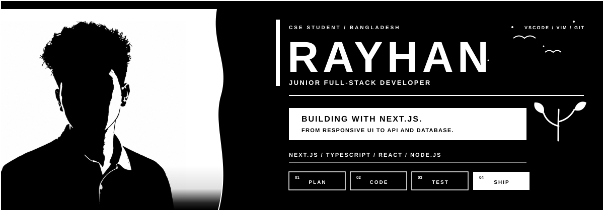
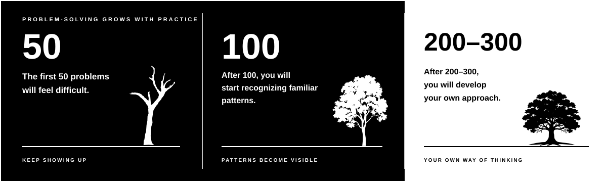

<!--
PROFILE CONFIG
GitHub  : https://github.com/MohammadRayhanHabib
LinkedIn: Replace YOUR_LINKEDIN_URL below
Email   : Replace YOUR_EMAIL below

Keep the assets/ folder beside this README.
The dark icon rows use https://skillicons.dev.
-->

<p align="center">
  
</p>

<p align="center">
  <strong>Junior Full-Stack Developer · CSE Student · Bangladesh</strong>
</p>

<p align="center">
  <a href="https://github.com/MohammadRayhanHabib">
    
  </a>
  <a href="YOUR_LINKEDIN_URL">
    
  </a>
  <a href="mailto:YOUR_EMAIL">
    
  </a>
</p>

<p align="center">
  
</p>

## 01 / About Me

I am **Rayhan**, a Computer Science and Engineering student from **Bangladesh**. I am currently working as a **Junior Developer**, building modern web applications and improving my engineering skills through real projects.

My main framework is **Next.js**. I enjoy working across the full stack—from responsive interfaces and reusable React components to APIs, authentication and databases.

- Currently working as a Junior Developer
- Building full-stack applications with Next.js
- Writing JavaScript and TypeScript
- Learning better backend architecture and database design
- Improving DSA, problem-solving and core computer science fundamentals

> I like clean interfaces, clear code and software that solves a real problem.

## 02 / Core Stack

<p align="center">
  
  
  
  
  
  
</p>

<p align="center">
  
</p>

| Area | Technologies |
|:---|:---|
| **Frontend** | Next.js, React, TypeScript, JavaScript, Tailwind CSS, HTML, CSS |
| **Backend** | Next.js Server Actions, Route Handlers, Node.js, REST APIs |
| **Database** | PostgreSQL, MongoDB, Prisma, Redis |
| **Deployment** | Vercel, Docker |

## 03 / Database & Backend

<p align="center">
  
  
  
  
  
</p>

<p align="center">
  
</p>

## 04 / Tools I Use

<p align="center">
  
</p>

| Workflow | Tools |
|:---|:---|
| **Editors** | VS Code, Vim |
| **Version Control** | Git, GitHub |
| **Development** | npm, Bash, Linux, Postman |
| **Design & Delivery** | Figma, Docker, Vercel |

## 05 / How I Build

```text
PLAN  →  CODE  →  TEST  →  SHIP  →  IMPROVE
```

- Start with the user problem and project requirements
- Design reusable components and a clear data flow
- Build the interface, API and database together
- Use Git branches and meaningful commits
- Test important flows before deployment
- Review the result and improve the next version

## 06 / Current Focus

- Production-ready Next.js applications
- Authentication, authorization and secure APIs
- Type-safe forms, validation and database queries
- Better Git and team development workflows
- Data structures, algorithms and CS fundamentals

### Problem-Solving Journey

<p align="center">
  
</p>

## 07 / Connect

<p align="center">
  <a href="https://github.com/MohammadRayhanHabib"><strong>GitHub</strong></a>
  &nbsp;&nbsp;·&nbsp;&nbsp;
  <a href="YOUR_LINKEDIN_URL"><strong>LinkedIn</strong></a>
  &nbsp;&nbsp;·&nbsp;&nbsp;
  <a href="mailto:YOUR_EMAIL"><strong>Email</strong></a>
</p>

<p align="center">
  <samp>NEXT.JS / TYPESCRIPT / REACT / NODE.JS / GIT</samp>
</p>

<p align="center">
  
</p>
